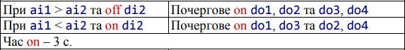
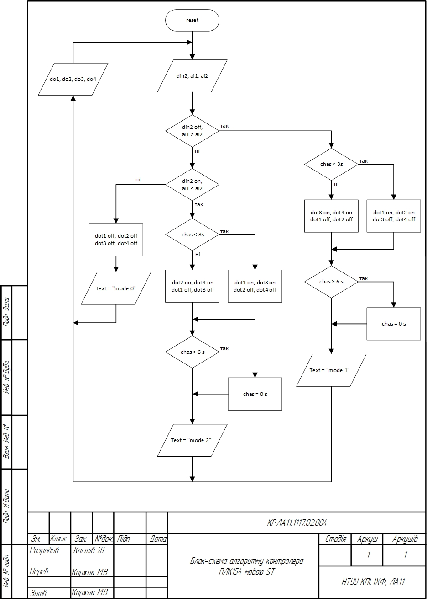
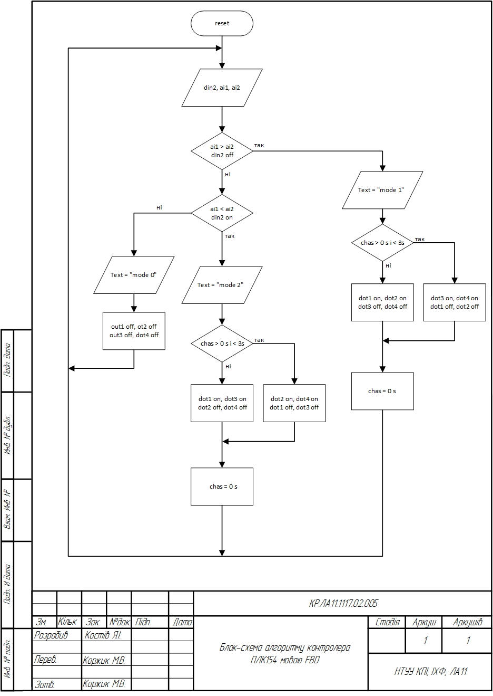
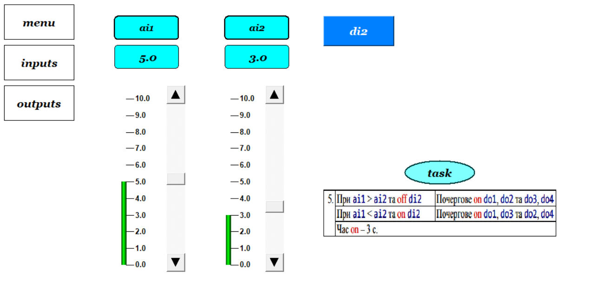
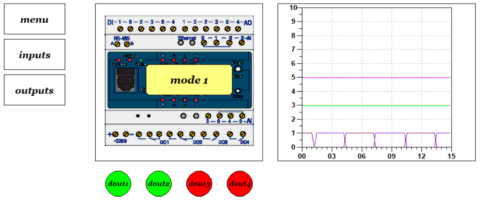
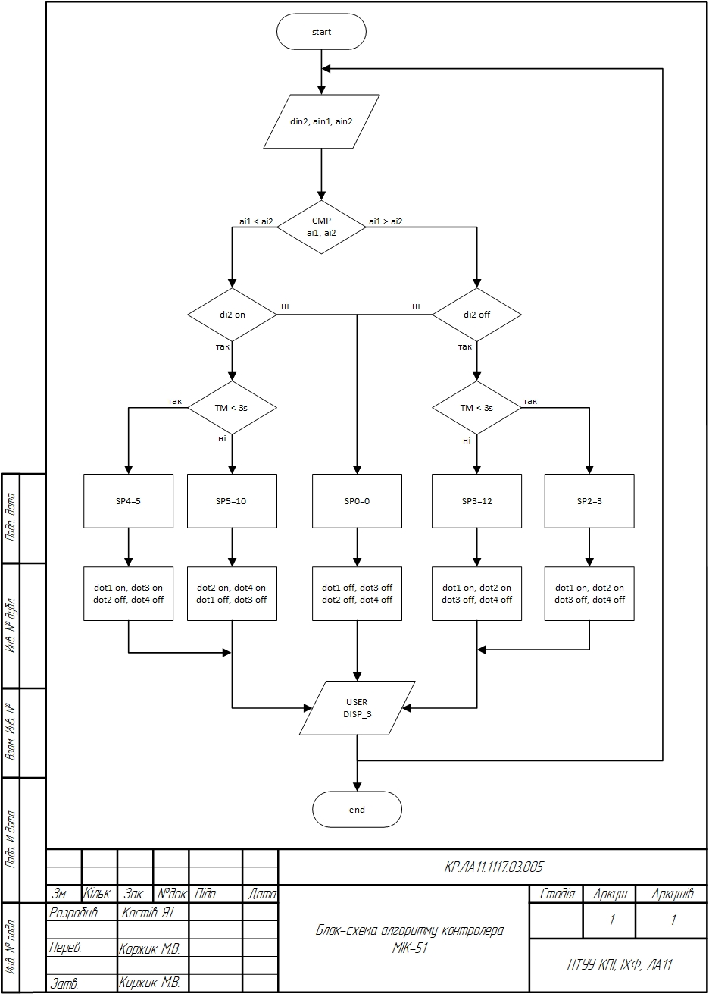
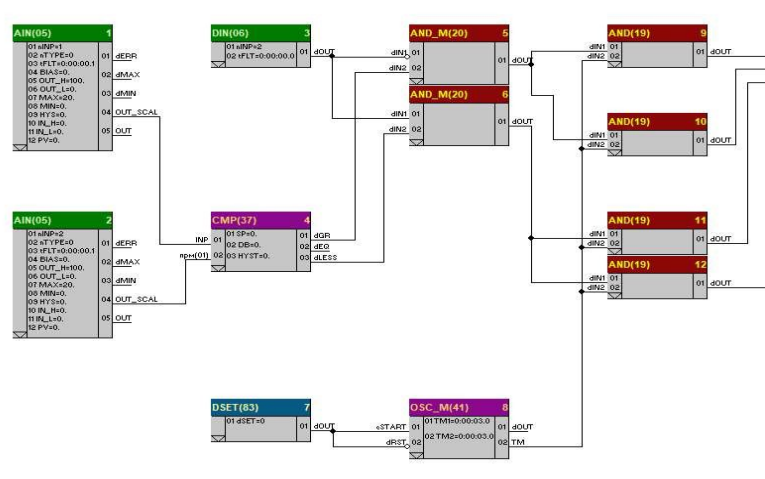
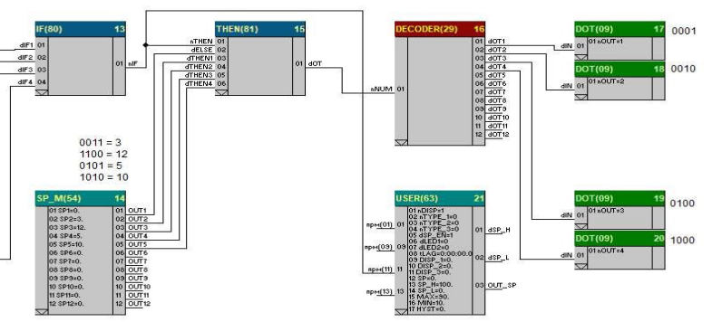
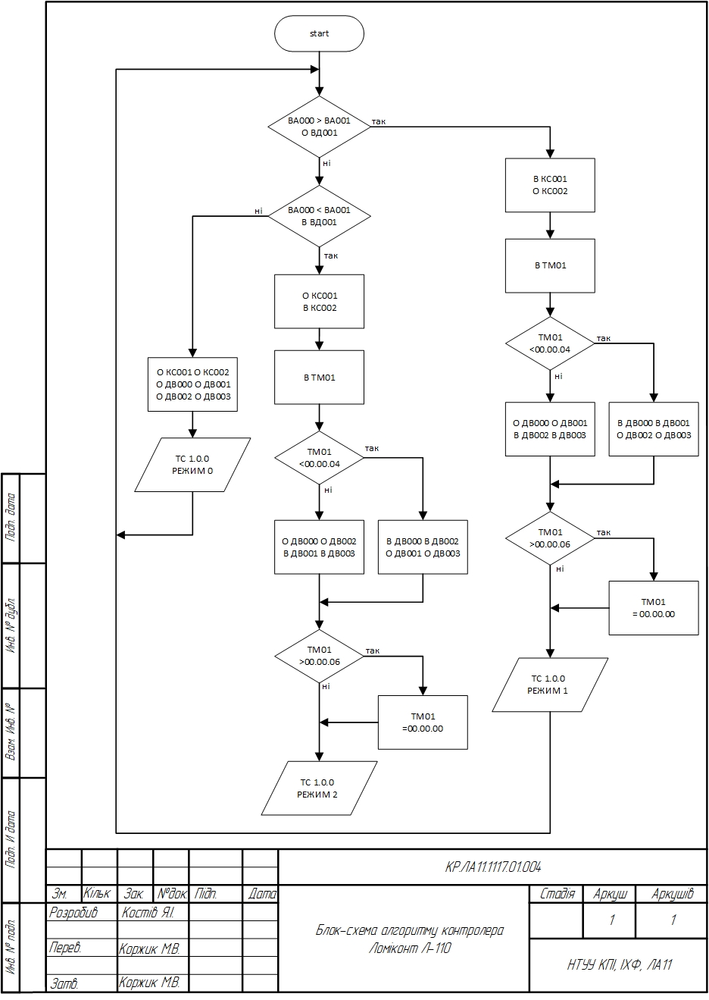

## Quick Navigation

- 🇬🇧 [English version](#control-of-discrete-outputs-of-industrial-plc-controllers)
- 🇺🇦 [Українська версія](#українська-версія)

---
# Control of Discrete Outputs of Industrial PLC Controllers

Course project for the discipline **Software and Hardware Support of Computer-Integrated Systems**

This project is devoted to the development of control algorithms for discrete outputs of three industrial programmable logic controllers:

- **Lomikont L-110**
- **PLC154**
- **MIK-51**

The work includes analysis of the control task, implementation of control logic for different PLC platforms, development of algorithms and wiring schemes, and comparison of controller-specific approaches.

---

## Project Highlights

- Development of discrete output control algorithms for three industrial PLC controllers
- Implementation using **Microl**, **Structured Text (ST)**, **Function Block Diagram (FBD)**, **CoDeSys**, and **Alfa**
- Visualization and debugging of PLC154 logic in **CoDeSys**
- Comparative analysis of different PLC programming environments and implementation approaches


---

## Overview

Modern automated control systems are widely used in industry to improve process efficiency, reliability and product quality.  
One of the key components of such systems is the **programmable logic controller (PLC)**.

A major function of PLCs is **control of discrete outputs**, which are used for relay switching, valve actuation, light indicators and other on/off devices.

This course project focuses on the development of algorithms for discrete output control based on input conditions and logical rules.

---

## Problem Statement

The control task is based on one discrete input and two analog inputs.

### Inputs
- `di2` — discrete input
- `ai1` — analog input
- `ai2` — analog input

### Outputs
- `do1`
- `do2`
- `do3`
- `do4`

### Control conditions

#### Mode 1
If:

`ai1 > ai2` and `di2 = OFF`

Then outputs are activated sequentially:

- `do1 + do2`
- `do3 + do4`

Switching time: **3 seconds**

#### Mode 2
If:

`ai1 < ai2` and `di2 = ON`

Then outputs are activated sequentially:

- `do1 + do3`
- `do2 + do4`

Switching time: **3 seconds**

#### Mode 0
If neither condition is satisfied:

- all outputs remain OFF

Additionally, each controller mode change must be accompanied by a **technological message** indicating the current operating state.



---

## Controllers Used

### Lomikont L-110
Lomikont L-110 is an industrial PLC suitable for multi-channel automation tasks.  
Programming is performed using the **Microl** language.  
The project includes algorithm development, I/O resource allocation, wiring scheme and user operation instructions.

### PLC154
PLC154 was implemented in **CoDeSys 2.3** using two IEC 61131-3 languages:

- **Structured Text (ST)**
- **Function Block Diagram (FBD)**

It also includes a visualization interface for simulation and debugging.

### MIK-51
MIK-51 is a compact multifunctional controller with flexible communication capabilities.  
Programming is carried out using **FBD** in the **Alfa 2.0** environment.

---

## Lomikont L-110

For Lomikont L-110, the algorithm was implemented in **Microl**.  
The controller operates in three independent modes and uses:

- one discrete input
- two analog inputs
- four discrete outputs
- one timer

The implementation includes:

- algorithm flowchart
- controller specification
- wiring scheme
- control logic stored in program sections
- user instructions for programming through the controller panel

### Files
- `code/lomikont_l110_control_algorithm.xlsx`
- `docs/lomikont_L110_specification.jpg`

### Illustrations


---

## PLC154

For PLC154, the task was implemented in **CoDeSys** using both **ST** and **FBD**.

The controller uses:
- `din2 : BOOL`
- `ai1 : REAL`
- `ai2 : REAL`
- `out1...out4 : BOOL`
- timers `TON` and `TOF`
- technological message string
- visualization screens for monitoring and input simulation

### ST Algorithm
The ST implementation uses conditional branching and timer-based switching.

```st
PROGRAM PLC_PRG
VAR
    timer3: TOF;
    reset: BOOL;
    chas: TIME;
    text: STRING;
END_VAR

timer3(IN := NOT reset, PT := t#6s, Q => reset, ET => chas);

IF (din2 = FALSE) AND (ai1 > ai2)
THEN
    IF chas < t#3s
    THEN
        text := 'mode 1';
        out1 := TRUE; out2 := TRUE;
        out3 := FALSE; out4 := FALSE;
    ELSE
        out1 := FALSE; out2 := FALSE;
        out3 := TRUE; out4 := TRUE;
    END_IF
ELSE
    out1 := FALSE; out2 := FALSE; out3 := FALSE; out4 := FALSE;
    text := 'mode 0';
END_IF

IF (din2 = TRUE) AND (ai1 < ai2)
THEN
    text := 'mode 2';
    IF chas < t#3s
    THEN
        out1 := TRUE; out3 := TRUE;
        out2 := FALSE; out4 := FALSE;
    ELSE
        out2 := TRUE; out4 := TRUE;
        out1 := FALSE; out3 := FALSE;
    END_IF
END_IF
````

### FBD Implementation

The same task was also implemented graphically in FBD.

### Visualization

Three visualization screens were created:

* main menu
* inputs
* outputs

These screens allow testing of controller behavior for all three modes.

### Files

* `code/plc154_codesys_2c_Kostiv.pro`
* `code/plc154_codesys_2fbd.pro`
* `docs/plc154_specification.jpg`

### Illustrations







---

## MIK-51

For MIK-51, the task was implemented in the **Alfa 2.0 FBD editor**.

The controller supports:

* analog inputs
* discrete inputs
* discrete outputs
* block-oriented logic
* user display messages

The implementation is divided into two major parts:

* **conditional part** — generation of the active mode
* **execution part** — assignment of output combinations

The following codes were formed for operating modes:

* `0` — all outputs OFF
* `0011 (3)` — first half-mode
* `1100 (12)` — second half-mode
* `0101 (5)` — third half-mode
* `1010 (10)` — fourth half-mode

### Files

* `code/mik51_control_program.fbx`
* `docs/mik51_specification_1.jpg`
* `docs/mik51_specification_2.jpg`

### Illustrations





---

## Wiring Schemes and Technical Documentation

The repository also contains technical documentation for all three controllers, including:

* specifications
* wiring schemes
* dimensional drawings
* controller-specific supporting drawings

### Dimensional drawings

* `drawings/npt1k_dimensions.jpg`
* `drawings/plc154_dimensions.jpg`
* `drawings/bpo432_dimensions.jpg`

### Additional documentation

* controller specifications
* wiring and connection diagrams
* course project report

---

## Comparative Analysis

A comparative analysis of the three controllers was performed.

### Lomikont L-110

* simple logic implementation
* suitable for large multi-channel systems
* programming through controller interface
* limited development convenience compared to modern IDEs

### PLC154

* most flexible implementation
* supports IEC 61131-3 languages
* convenient programming in CoDeSys
* supports visualization and simulation
* well suited for structured and maintainable control logic

### MIK-51

* compact and flexible controller
* convenient FBD-based logic design in Alfa
* suitable for compact automation systems
* good real-time observation of block behavior

Overall, all three controllers successfully solve the required task, but differ in development convenience, programming flexibility and integration possibilities.

---

## Technologies Used

* PLC programming
* Microl
* Structured Text (ST)
* Function Block Diagram (FBD)
* IEC 61131-3
* CoDeSys 2.3
* Alfa 2.0

---

## Repository Structure

```text
.
├── README.md
├── course_project_report.pdf
├── code
│   ├── lomikont_l110_control_algorithm.xlsx
│   ├── mik51_control_program.fbx
│   ├── plc154_codesys_2c_Kostiv.pro
│   └── plc154_codesys_2fbd.pro
├── docs
│   ├── lomikont_L110_specification.jpg
│   ├── mik51_specification_1.jpg
│   ├── mik51_specification_2.jpg
│   └── plc154_specification.jpg
├── drawings
│   ├── bpo432_dimensions.jpg
│   ├── npt1k_dimensions.jpg
│   └── plc154_dimensions.jpg
└── images
    ├── task.jpg
    ├── lomikont
    ├── mik51
    └── plc154
```

---

## Conclusion

This course project presents the development and comparative study of discrete output control algorithms for three industrial PLC controllers:

* Lomikont L-110
* PLC154
* MIK-51

For each controller, the corresponding algorithm, technical documentation, wiring scheme and user guidance were prepared.

The results show that all three controllers provide reliable control of discrete outputs, while each platform has its own advantages depending on the task and industrial context.

---

# Українська версія

## Вступ

Сучасні автоматизовані системи управління широко використовуються в різних галузях промисловості для забезпечення високої ефективності виробничих процесів. Одним із ключових елементів таких систем є програмовані логічні контролери (PLC), які забезпечують автоматизацію та контроль технологічних процесів.

Однією з головних функцій контролерів є керування дискретними виходами. Дискретні виходи використовуються для керування реле, світлодіодами, електромагнітними клапанами та іншими компонентами, що працюють у режимі вмикання/вимикання.

У цій курсовій роботі розглянуто розробку алгоритмів керування дискретними виходами для трьох контролерів:

* **Ломіконт Л-110**
* **ПЛК154**
* **МІК-51**

---

## Постановка задачі

Метою курсової роботи є розробка та впровадження алгоритму керування для PLC, який виконує визначену логіку на основі вхідних та вихідних сигналів.

### Вхідні сигнали

* `di2` — дискретний вхід
* `ai1` — перший аналоговий вхід
* `ai2` — другий аналоговий вхід

### Вихідні сигнали

* `do1`
* `do2`
* `do3`
* `do4`

### Умови роботи

#### Режим 1

При:

`ai1 > ai2` та `di2 = OFF`

Виконується почергове ввімкнення:

* `do1 + do2`
* `do3 + do4`

Час ввімкнення — **3 с**

#### Режим 2

При:

`ai1 < ai2` та `di2 = ON`

Виконується почергове ввімкнення:

* `do1 + do3`
* `do2 + do4`

Час ввімкнення — **3 с**

#### Режим 0

Якщо жодна з умов не виконується:

* усі виходи вимкнені

Кожна зміна режиму супроводжується виведенням технологічного повідомлення.


---

## Ломіконт Л-110

Для контролера **Ломіконт Л-110** алгоритм реалізовано мовою **Мікрол**.

У межах реалізації було:

* визначено ресурс контролера
* побудовано блок-схему алгоритму
* розроблено логіку роботи для трьох режимів
* підготовлено схему комутації
* оформлено специфікацію обладнання
* підготовлено настанови користувача

### Файли

* `code/lomikont_l110_control_algorithm.xlsx`
* `docs/lomikont_L110_specification.jpg`

### Ілюстрації



---

## ПЛК154

Для контролера **ПЛК154** алгоритм реалізовано в середовищі **CoDeSys 2.3** двома мовами стандарту **IEC 61131-3**:

* **ST**
* **FBD**

У проєкті використано:

* дискретний вхід `din2`
* аналогові входи `ai1`, `ai2`
* дискретні виходи `out1...out4`
* таймери `TON`, `TOF`
* технологічне повідомлення `text`
* візуалізацію режимів роботи

Було створено:

* блок-схему алгоритму мовою ST
* блок-схему алгоритму мовою FBD
* програму керування мовою FBD
* програму керування мовою ST
* екрани візуалізації для налагодження

### Файли

* `code/plc154_codesys_2c_Kostiv.pro`
* `code/plc154_codesys_2fbd.pro`
* `docs/plc154_specification.jpg`

### Ілюстрації


---

## МІК-51

Для контролера **МІК-51** алгоритм реалізовано мовою **FBD** у середовищі **Alfa 2.0**.

У роботі було:

* проаналізовано ресурс контролера
* побудовано блок-схему алгоритму
* створено умовну частину алгоритму
* створено виконавчу частину алгоритму
* підготовлено схему комутації
* підготовлено специфікацію обладнання
* сформовано користувацькі настанови

Умовна частина визначає активний режим, а виконавча частина відповідає за формування кодів виходів та передачу їх на дискретні канали.

### Файли

* `code/mik51_control_program.fbx`
* `docs/mik51_specification_1.jpg`
* `docs/mik51_specification_2.jpg`

### Ілюстрації


---

## Технічна документація

Репозиторій також містить технічну документацію:

* специфікації контролерів
* схеми комутації
* габаритні креслення обладнання
* пояснювальну записку курсової роботи

### Габаритні креслення

* `drawings/npt1k_dimensions.jpg`
* `drawings/plc154_dimensions.jpg`
* `drawings/bpo432_dimensions.jpg`

---

## Порівняльний аналіз

У роботі проведено порівняльний аналіз трьох контролерів.

### Ломіконт Л-110

* простий у використанні
* придатний для багатоканальних задач
* програмування через інтерфейс контролера
* менш гнучкий у порівнянні з сучасними середовищами

### ПЛК154

* найвища гнучкість реалізації
* підтримка мов IEC 61131-3
* зручне програмування в CoDeSys
* візуалізація і режим симуляції

### МІК-51

* компактний контролер
* зручне програмування у FBD-редакторі
* розширені можливості зв’язку
* наочна робота зі станом блоків у редакторі Alfa

---

## Використані технології

* PLC programming
* Microl
* Structured Text (ST)
* Function Block Diagram (FBD)
* IEC 61131-3
* CoDeSys 2.3
* Alfa 2.0

---

## Висновки

У ході виконання курсової роботи було проведено дослідження та порівняльний аналіз реалізації алгоритмів керування дискретними виходами для трьох різних контролерів:

* Ломіконт Л-110
* ПЛК154
* МІК-51

Для кожного контролера було розроблено алгоритм керування, підготовлено технічну документацію, схеми комутації, блок-схеми та користувацькі настанови.

Усі три контролери показали надійність і ефективність, але кожен з них має власні переваги залежно від конкретної задачі автоматизації.
